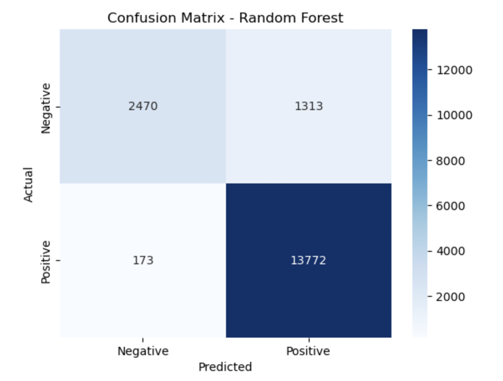
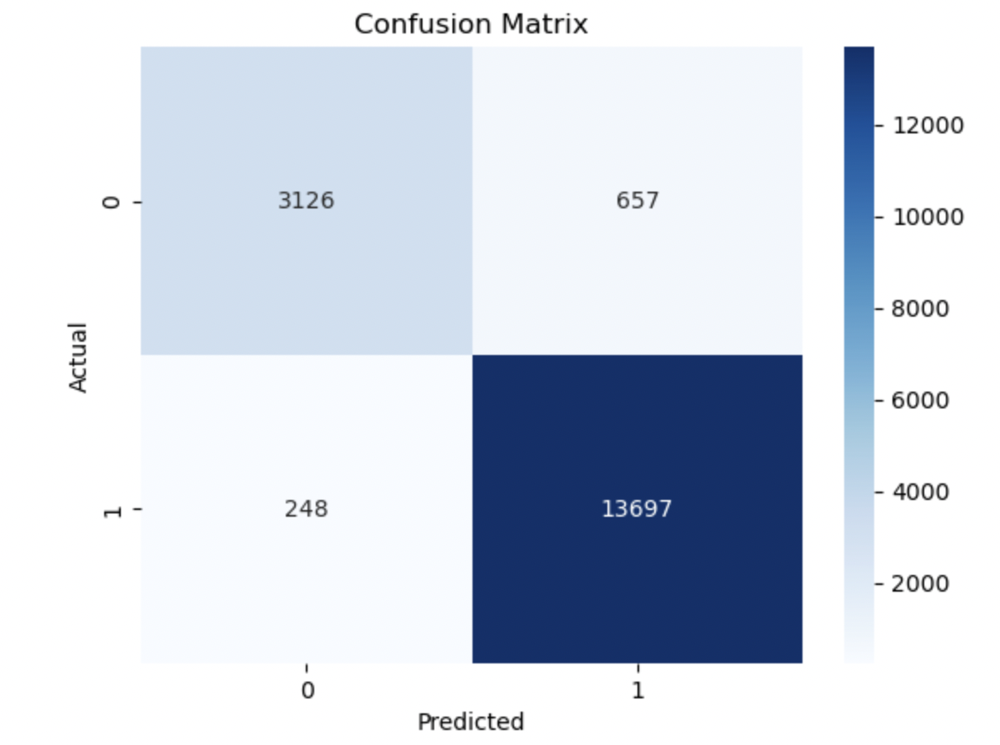

# Yelp_Restaurant_Review_Data_Project

---

## 🧭 Project Roadmap

## 🔍 Phase 1: Data Exploration & SQL Analysis  
**Goal:** Explore and analyze the Yelp Open Dataset using SQL and Python, with a focus on restaurant-related businesses. This phase establishes a strong foundation for data querying, cleaning, and visualization.

---

### 🎯 Project Purpose

- Clean and transform real-world JSON data from Yelp  
- Use SQL to answer practical, business-relevant questions  
- Gain insights into restaurant density, popularity, and performance across cities and categories  
- Create visual summaries to support further dashboarding and modeling work

---

### 🧰 Tools Used

- **Python (Pandas)** – Data loading, transformation, and category processing  
- **SQLite (via sqlite3)** – SQL querying and data summarization  
- **Matplotlib & Seaborn** – Visualizing city and category-level metrics  
- **Jupyter Notebook** – Interactive environment for exploration and reporting

---

### 📊 Summary of SQL Insights

- **Las Vegas** has the highest number of restaurants in the dataset, followed by **Phoenix** and **Toronto**, confirming these cities as Yelp’s most active restaurant markets.

- Cities with a **high volume of restaurants** don’t always have the **highest average ratings**. Some mid-sized cities have fewer restaurants but better-rated businesses on average.

- The most frequently listed restaurant types include **Mexican**, **Pizza**, **American (Traditional)**, **Japanese**, and **Chinese** cuisine.

- While **4-star restaurants** are more common, **5-star restaurants** receive fewer reviews on average, possibly because they represent newer or more niche businesses.

- In the breakdown by city, some locations have **higher engagement at 4-star level**, while others (e.g., smaller cities) show **higher review rates for top-tier 5-star restaurants**, suggesting different customer behavior and local market dynamics.

---

## 📊 Phase 2: Interactive Dashboard with Google Looker Studio  
**Goal:** Communicate business insights from the Yelp dataset through an interactive, web-based dashboard. Phase 2 translates SQL and Python data analysis into clear visual storytelling designed for strategic decision-making.

---

### 🎯 Use Case

**Target Audience:**  
- *Restaurant owners and investors deciding where to open a new location*

**Business Question:**  
*Where are the best opportunities to open a restaurant based on local competition, review volume, and ratings?*

This dashboard is designed to help users:
- Identify cities with high restaurant density or untapped demand  
- Understand which categories are most competitive or highly rated  
- Explore star ratings and review volumes by geography

---

### 🛠️ Tools & Technologies

| Tool                  | Purpose                                      |
|-----------------------|----------------------------------------------|
| **Google Looker Studio** | Interactive dashboard creation and sharing |
| **Python (pandas)**   | Data cleaning and transformation              |
| **SQLite**            | SQL querying and data filtering               |
| **Google Sheets**     | Data connector for Looker Studio              |

---

### 🔧 Workflow Overview

1. **Data Preparation in Python:**
   - Extracted restaurant businesses from `yelp_academic_dataset_business.json`
   - Selected key fields: `business_id`, `name`, `categories`, `city`, `state`, `latitude`, `longitude`, `stars`, `review_count`
   - Cleaned and filtered to remove missing or non-relevant records

2. **CSV Export for Looker Studio:**
   - Exported cleaned data to `clean_restaurant_dataset.csv`
   - Loaded the file into **Google Sheets** for dynamic connection to Looker Studio

3. **Dashboard Construction:**
   - Built multiple pages and views to explore restaurant distribution and performance
   - Applied filters for city, category, and rating
   - Used Looker Studio features like maps, bar charts, scorecards (KPIs), and category breakdowns

---
### 🔗 Dashboard Access

- **📄 PDF version (static snapshot):**  
  File: `dashboard/Yelp_Restaurant_Insights_Dashboard_Report.pdf`

- **🌐 Interactive dashboard (recommended):**  
  [Yelp Restaurant Insights Dashboard Report (Google Looker Studio)](https://lookerstudio.google.com/s/tE5yTNRuoms)

> ⚠️ *Note: The PDF version provides a static overview and does not support interactive features such as filtering by city, category, or rating. For the full experience, please use the Looker Studio link above.*

---
### 📊 Dashboard Features

- **Map of Business Locations** by average star rating  
- **Category Breakdown**: most common restaurant types by count and rating  
- **City-Level KPIs**: total restaurants, average stars, review totals  
- **Interactive Filters** for city, rating level, and category

---

### 📁 Deliverables

- `notebooks/` → Python notebooks with data loading, filtering, and export  
- `data/` → Cleaned dataset for dashboard (e.g., `clean_restaurant_dataset.csv`)  
- `dashboard/` → Google Looker Studio screenshots and links  
- `README.md` → This file 

---

## 🤖 Phase 3: Predictive Modeling (Sentiment Analysis)

**Goal:** Predict whether a Yelp restaurant review is **positive (4–5 stars)** or **negative (1–2 stars)** based on the content of the review text. This enables scalable, automated sentiment classification across thousands of customer reviews.

---

### 📌 Dataset & Preprocessing

- **Source:** `yelp_academic_dataset_review.json` (100,000 sampled reviews)
- **Labeling:**
  - `1` = Positive (stars ≥ 4)
  - `0` = Negative (stars ≤ 2)
- **Excluded:** 3-star neutral reviews
- **Preprocessing steps:**
  - Text lowercasing
  - Stopword removal
  - TF-IDF vectorization (10,000 features)

---

### 🧠 Models & Evaluation

#### 1️⃣ **Logistic Regression (Baseline)**

| Metric         | Negative (0) | Positive (1) |
|----------------|--------------|--------------|
| **Precision**  | 0.93         | 0.95         |
| **Recall**     | 0.83         | 0.98         |
| **F1-score**   | 0.87         | 0.97         |
| **Support**    | 3,783        | 13,945       |

- **Overall Accuracy:** 95%
- **Weighted F1-score:** 0.95

**Confusion Matrix – Logistic Regression:**

**Insight:**  
The model performs strongly across both classes, especially for positive reviews. While there are some false negatives (positive reviews predicted as negative), the model maintains an overall strong balance.

---

#### 2️⃣ **Random Forest**

| Metric         | Negative (0) | Positive (1) |
|----------------|--------------|--------------|
| **Precision**  | 0.93         | 0.91         |
| **Recall**     | 0.65         | 0.99         |
| **F1-score**   | 0.77         | 0.95         |
| **Support**    | 3,783        | 13,945       |

- **Overall Accuracy:** 92%
- **Weighted F1-score:** 0.91

**Confusion Matrix – Random Forest:**

**Insight:**  
Random Forest achieves high performance for positive reviews, but shows a noticeable drop in **recall for negative reviews**. This suggests it tends to favor classifying reviews as positive, possibly due to class imbalance or subtlety in negative language.

---

### 📁 Deliverables

- `ml_project/review_sentiment_analysis.ipynb` – Jupyter notebook with data processing, model training, and evaluation
- `dashboard/screenshots/` – Confusion matrix plots for both models
- `README.md` – Updated with problem description, model performance, and key findings 

